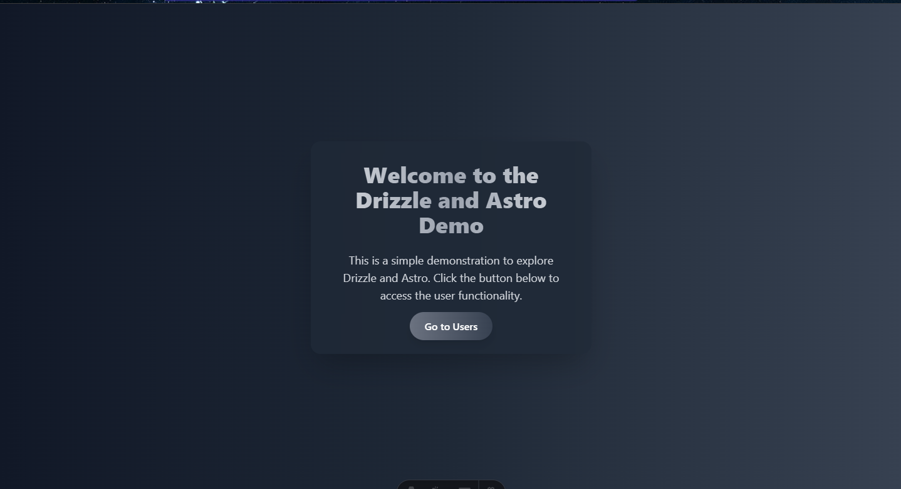
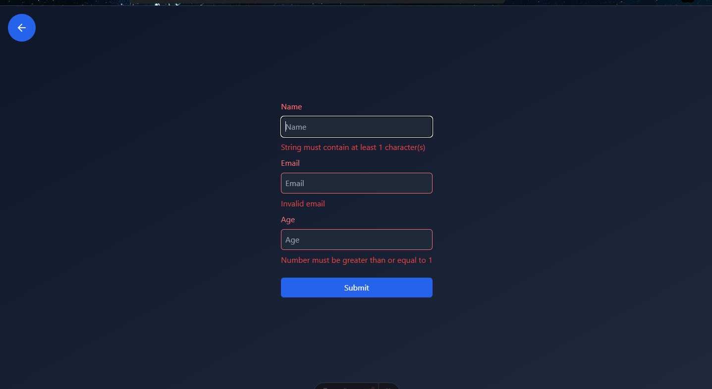

# Static Profile Page with Astro & Drizzle

  


## Description

This is a small static page built with **Astro** and **Drizzle**. It allows rendering a list of profiles with a visually appealing experience thanks to small animations and support for light and dark themes.

## Features

-   **View profiles:** Go to `/users` to see a list of existing profiles.
-   **Add profiles:** Use `/users/add` to add new profiles.
-   **View details:** Access `/users/[id]` to view information about a specific profile.

## Technologies Used

-   **Astro:** Fast and flexible framework for building static pages.
-   **Drizzle ORM:** Simple and type-safe database handling for TypeScript.
-   **Tailwind CSS:** Modern and responsive styling.

## Installation and Usage

1. Clone the repository:

    ```bash
    git clone <repository-url>
    ```

2. Navigate to the project directory:

    ```bash
    cd astro-drizzle-project
    ```

3. Install the dependencies:

    ```bash
    npm install
    ```

4. Start the development server:

    ```bash
    npm run dev
    ```

5. Open the browser at [http://localhost:4321](http://localhost:4321).

## Screenshots





## License

This project is under the MIT license. You can find more details in the `LICENSE` file.
